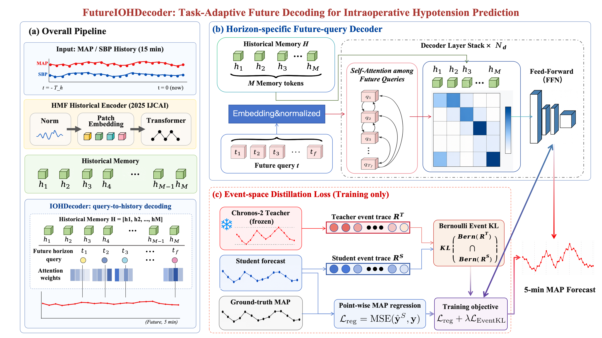
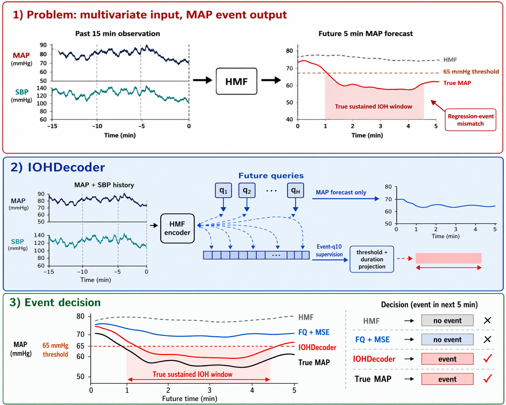
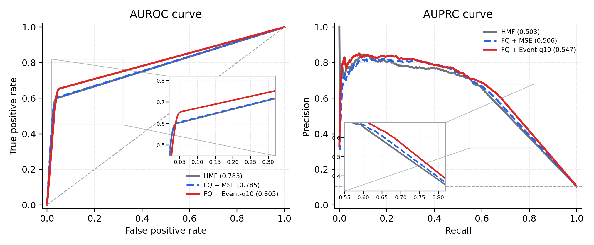
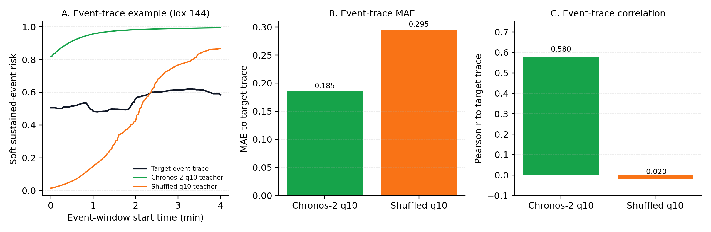
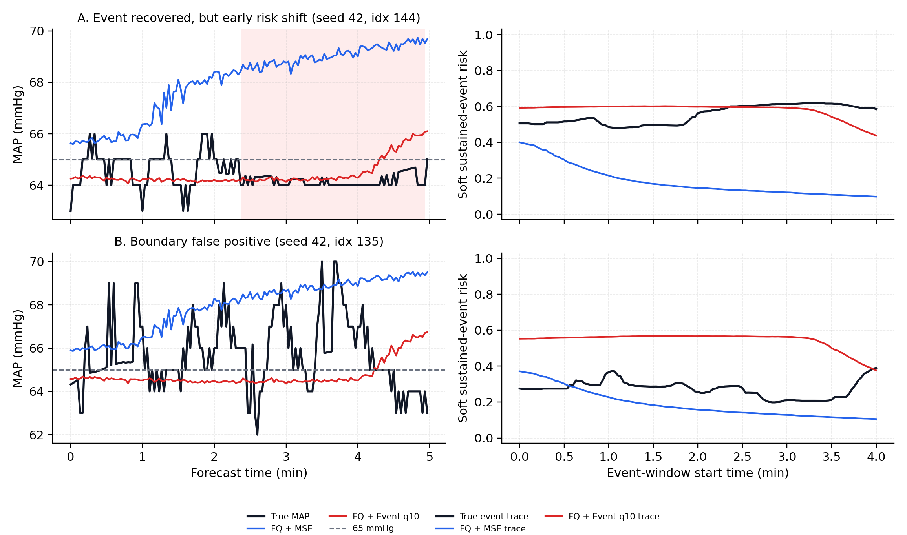

# IOHDecoder

**Task-Adaptive Future Decoding for Intraoperative Hypotension Prediction**

IOHDecoder is a lightweight model for intraoperative hypotension (IOH) warning.
It predicts the future mean arterial pressure (MAP) trajectory and converts the
trajectory into a sustained-hypotension event decision.

The released code keeps the core method from the paper:

- an HMF-style MAP/SBP historical encoder,
- a horizon-specific future-query decoder,
- lower-tail event-space distillation from an offline Chronos-2 q10 teacher,
- teacher-free inference with only the student model.

## Motivation

IOH is not just a pointwise regression problem. In our main VitalDB 2 s
protocol, an IOH event is defined as future MAP staying below 65 mmHg for a
continuous 1 minute window. A model can reduce average MAP error while smoothing
away the short low-tail trough that determines the event label.

IOHDecoder is designed for this mismatch between MAP regression and sustained
event detection. It keeps MAP prediction as the base task, but adds future
horizon-specific decoding and event-oriented low-tail supervision.

## Method Overview

IOHDecoder has three main components.

**HMF Encoder.** The encoder receives historical MAP/SBP signals and builds
historical memory with instance normalization, moving-average trend/seasonal
decomposition, patch embedding, and Transformer patch encoders. The original HMF
shared forecasting head is not used here; IOHDecoder uses HMF only as the
historical encoder.

**Future-query Decoder.** Instead of producing the whole future trajectory from
one shared prediction head, IOHDecoder assigns each future horizon its own query.
These queries attend to the HMF memory and retrieve horizon-specific evidence.
This gives near-term, trough, and recovery points different routes to use the
history, which helps avoid overly smooth forecasts.

**Lower-tail Event-space Distillation.** Chronos-2 is used offline to produce a
lower-tail q10 teacher forecast. During training, IOHDecoder does not directly
copy the teacher's raw MAP values. The teacher forecast and student forecast are
both converted into a soft sustained-IOH event trace, and the student learns the
teacher's event-risk shape. This makes the supervision focus on future windows
that are likely to form sustained hypotension, while MSE keeps the MAP scale
calibrated.

At inference time, Chronos-2 and the teacher cache are not loaded. The deployed
model is only the HMF encoder plus future-query decoder.

## What Is Included

This release intentionally keeps only the paper method:

| Path | Purpose |
|---|---|
| `iohdecoder/model/` | HMF encoder and future-query IOHDecoder |
| `iohdecoder/losses/` | MAP regression plus lower-tail Event-KL objective |
| `iohdecoder/data/` | Dataset and DataLoader utilities |
| `iohdecoder/teachers/` | Split-aligned teacher cache loader |
| `iohdecoder/metrics/` | MAP regression and sustained-IOH event metrics |
| `iohdecoder/engine.py` | Model construction, training, checkpointing, evaluation helpers |

Baseline-only models and diagnostic ablations are not included in this release.

## Data Protocol

The main paper setting uses VitalDB at 2 s resolution:

| Item | Setting |
|---|---:|
| Dynamic inputs | ART_MBP, ART_SBP |
| Static inputs | age, sex, BMI, ASA |
| History window | 15 min, 450 steps |
| Prediction horizon | 5 min, 150 steps |
| IOH threshold | MAP < 65 mmHg |
| IOH duration | 1 min, 30 steps |

The training pipeline expects preprocessed train/validation/test pickle files
and normalization statistics. Event-KL training also expects an offline teacher
cache aligned to the dataset splits. The teacher cache stores the Chronos-2 q10
forecast for each sample and is used only during training.

## Main Results

On VitalDB 2 s with seeds 42/43/44, IOHDecoder improves event-level performance
over the strong HMF baseline while maintaining MAP calibration.

| Method | MSE | MAE | AUROC | AUPRC | F1 | Recall |
|---|---:|---:|---:|---:|---:|---:|
| HMF | 85.375 +/- 0.997 | 5.476 +/- 0.023 | 0.783 +/- 0.002 | 0.503 +/- 0.006 | 0.622 +/- 0.007 | 55.682 +/- 0.601 |
| FQ + MSE | 81.315 +/- 0.775 | 5.396 +/- 0.227 | 0.785 +/- 0.030 | 0.506 +/- 0.027 | 0.609 +/- 0.030 | 52.955 +/- 6.187 |
| IOHDecoder | 84.518 +/- 2.536 | 5.305 +/- 0.064 | 0.805 +/- 0.017 | 0.547 +/- 0.022 | 0.644 +/- 0.005 | 63.182 +/- 3.884 |

The main pattern is that pure future-query decoding improves MAP fitting, while
lower-tail event-space distillation improves event recognition. IOHDecoder
trades a small amount of pure MSE optimality for stronger F1, AUPRC, AUROC, and
Recall, which better matches the clinical warning objective.

## Teacher Trace Sanity Check

The q10 teacher trace preserves time structure related to sustained IOH risk.
When the teacher trace is shuffled, this structure disappears. This supports the
use of Chronos-2 q10 as a training-time low-tail event-risk teacher, rather than
as a raw MAP answer to copy.

## Case Study

The case visualization shows the intended behavior: compared with an MSE-only
future-query model, Event-KL training can preserve near-threshold low-tail risk
that would otherwise be smoothed away. This improves sensitivity to future
sustained hypotension windows.

## Notes

- The teacher is used only during training.
- The deployed model does not load Chronos-2.
- Event traces are computed in raw mmHg scale.
- The reported paper results use case-level train/validation/test splits before
  sliding-window sample generation to avoid leakage.
- Teacher quantile selection is performed on validation data; the main method
  uses q10.

